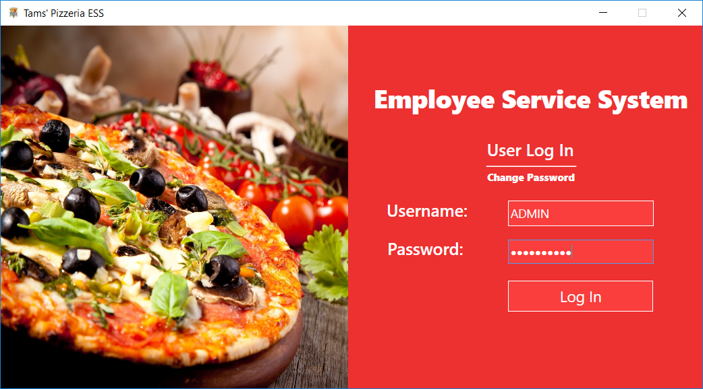
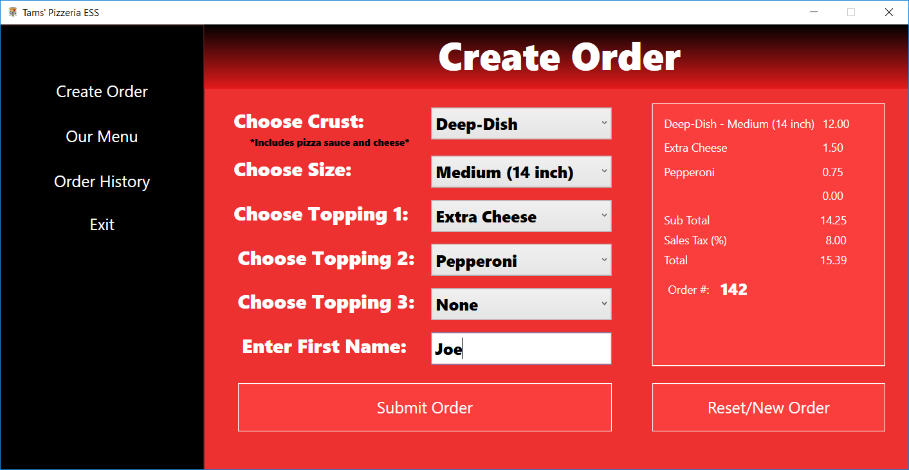
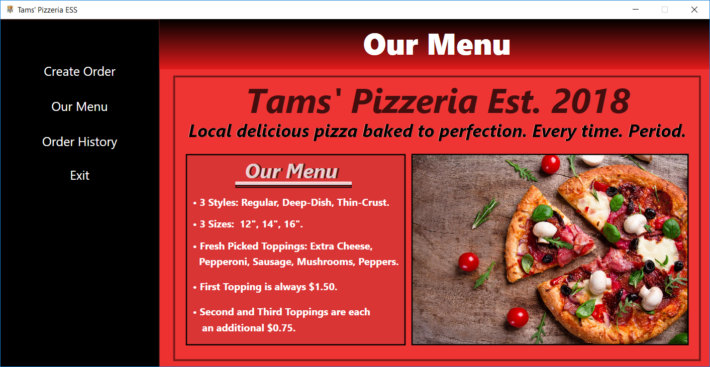
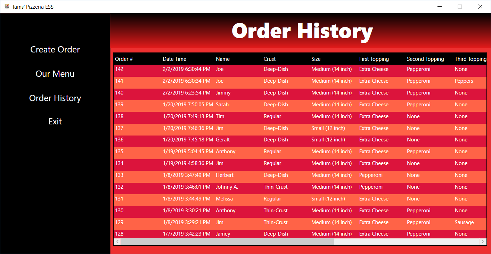
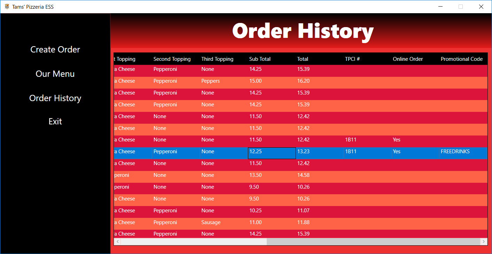

# Tams-Pizzera-Employee-Service-System
C# WPF/XAML Application. This side-project was developed with the intention of creating an employee portal for a restaurant business. The employee uses such an application like this one to create customer orders at work. Data is processed and retrieved using MS SQL SERVER. This particular application is themed around a fictional pizza restaurant called Tams Pizzeria. There is a Tams' Pizzeria website developed in ASP.NET (will upload in the future) that complements this application allowing users to order online.

****REQUIRED INFORMATION****

IMPORTANT! This application connects to Microsoft SQL Server for data fetching and processing. 
All occurrences of connectionString in the source code files (.cs files) must be updated to work with your database!

Otherwise, you will get authentication errors when trying to log in, etc.

I will soon provide an update with the database and table design diagrams to show the how this application interacts to the corresponding
data using Microsoft SQL Server.

I plan on updating or adding functionality to this project in the future.

Thomas O.

APPLICATION OUTPUT IMAGES

